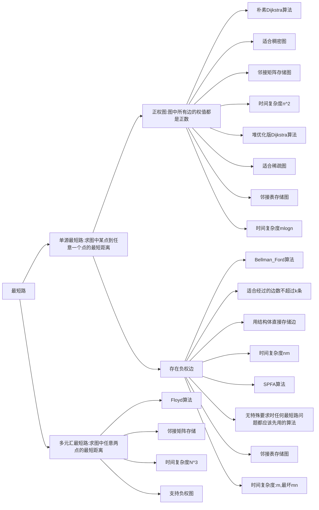

# 一、最短路问题概述

&emsp;&emsp;最短路算法的具体分类如下，每类问题都对应有具体的最适合的算法，其中``n``是图中的点数，``m``是图中的边数。





&emsp;&emsp;最短路问题考察的重点一般是如何建图使得原问题可以转化为一个最短路问题，所以重点是算法的实现，具体的算法的原理证明我们不做讲解。

&emsp;&emsp;和前面的图论存储类似，无向图是一种特殊的有向图，所以我们可以只管有向图的实现，这样也可以解决无向图的最短路。

# 二、朴素版Dijkstra算法—稠密正权图

## 1 算法思想

&emsp;&emsp;先初始化距离，``dist[1] = 0（起点距离确定), dist[其他] = +∞``;

&emsp;&emsp;设集合s是当前已经确定与起点的最短距离的点的集合。

&emsp;&emsp;一个for循环循环n次，每次都找不在s中的距离起点最近的点t，然后让t入s，并且使用t向外出去的边更新其他不在s中的点到起点的最短距离(其实就是看看``d[x] > d[t] + wtx``，可以看出这是一个贪心的思想。


&emsp;&emsp;外层循环的n次，内层找最小值和更新最小值的n次，所以时间复杂度为``O(n^2)``.

&emsp;&emsp;稠密图使用邻接矩阵来存储，所以本算法对应的图都是用邻接矩阵来实现。


## 2 代码实现


&emsp;&emsp;对于自环和重边的问题：在边权值都是正值的情况下，自环一定不会出现在最短路中；重边的问题我们可以考虑只取一条距离最短的边即可。

代码：

```cpp
#include <iostream>
#include <cstring>
using namespace std;

const int N = 510;

int g[N][N];// 邻接矩阵
int d[N];// dijkstra算法中每个点和起点的距离
bool st[N];// s集合 表示当前点是否确定了与起点的最短路
int n;// 点数
int m;// 边数

int Dijkstra()
{
    // 先把距离都初始化成无穷
    memset(d, 0x3f, sizeof(d));
    d[1] = 0;// 起点到起点的距离设置成0
    for (int i = 1; i <= n; ++i)
    {
        // 找不在s中的距离起点最近的点
        int t = -1;
        for (int j = 1; j <= n; ++j)
        {
            if (!st[j] && (t == -1 || d[j] < d[t]))
                t = j;
        }
        // t入s
        st[t] = true;
        // 更新其他点的距离
        for (int j = 1; j <= n; ++j)
        {
            d[j] = min(d[j], d[t] + g[t][j]);
        }
    }
    // 如果n和1的距离是正无穷 说明它们不连通 返回-1即可
    if (d[n] == 0x3f3f3f3f) return -1;
    return d[n];
}

int main()
{
    cin >> n >> m;
    memset(g, 0x3f, sizeof(g));// 先把邻接矩阵初始化成全部都是无穷大
    int a, b, c;
    while (m--)
    {
        cin >> a >> b >> c;
        // 因为存在重边 所以取最小值
        g[a][b] = min(g[a][b], c);
    }
    int ret = Dijkstra();
    cout << ret << endl;
    return 0;
}
```

## 3 时间复杂度

&emsp;&emsp;n轮找距离起点最近的点``t``: ``O(n^2)``，``t``入``s``:``O(1)``，根据边更新距离：``O(m)``，总时间复杂度``O(n^2)``.

## 4 LeetCode743.网络延迟时间


&emsp;&emsp;本题就是一个典型的单源权值都为正的最短路问题，并且其边数的数量级比较大，适合朴素版本Dijkstra算法，需要注意的是我们把把起点改为k，并且检查一下最后是否所有的点都被不是``+∞``即可。

```cpp
class Solution {
public:
    static const int N = 110;
    int g[N][N];
    bool st[N] = {0};
    int dist[N];
    int _n;

    int Dijkstra(int k)
    {
        memset(dist, 0x3f, sizeof(dist));
        memset(st, 0, sizeof(st));
        dist[k] = 0;
        for (int i = 1; i <= _n; ++i)
        {
            int t = -1;
            for (int j = 1; j <= _n; ++j)
            {
                if (!st[j] && (t == -1 || dist[j] < dist[t]))
                {
                    t = j;
                }
            }
            st[t] = true;
            for (int j = 1; j <= _n; ++j)
            {
                dist[j] = min(dist[j], dist[t] + g[t][j]);
            }
        }
        bool flag = true;
        int curmax = 0;
        for (int i = 1; i <= _n; ++i)
        {
            if (dist[i] == 0x3f3f3f3f)
            {
                flag = false;
                break;
            }
            curmax = max(curmax, dist[i]);
        }
        return flag == false ? -1 : curmax;
    }

    int networkDelayTime(vector<vector<int>>& times, int n, int k) 
    {
        _n = n;
        memset(g, 0x3f, sizeof(g));
        for (auto& time : times)
        {
            int u = time[0], v = time[1], w = time[2];
            g[u][v] = min(g[u][v], w);
        }
        int ret = Dijkstra(k);
        return ret;
    }
};
```

# 二、堆优化版本Dijkstra算法—稀疏正权图

## 1 算法思想


&emsp;&emsp;	但其实``logm``和``logn``是一个级别的，因为``m < n ^ 2``, ``logm < 2logn``，所以从实现简洁上考虑，C++中内置的优先队列更优秀一些。

&emsp;&emsp;总体思路就是用获取堆顶来替代找不在s中距离起点最近的点t，外层的n循环改用``pq``非空，以t更新距离遍历n个点改为利用邻接表找边来更新。

## 2 代码实现

&emsp;&emsp;本算法对应稀疏图的最短路求解，所以存储矩阵的方式是邻接表法。


```cpp
#include <iostream>
#include <cstring>
#include <queue>
using namespace std;

// 第一个关键字是距离 第二个关键字是编号
typedef pair<int, int> PII;
//由于是稀疏图 我们用邻接表来存
const int N = 150010;

int h[N];
int ne[N];
int e[N];
int idx = 0;
int w[N];// 边的权值

int dist[N];// 最短距离数组
bool st[N];// s集合

int n, m;

void add(int u, int v, int c)
{
    e[idx] = v;
    w[idx] = c;// 更新边的权值
    ne[idx] = h[u];
    h[u] = idx;
    ++idx;
}

int Dijkstra()
{
    // 小跟堆 C++STL默认是大根堆 所以要指定一下
    priority_queue<PII, vector<PII>, greater<PII>> pq;
    memset(dist, 0x3f, sizeof(dist));
    dist[1] = 0;
    pq.push({0, 1});
    // 把外层遍历n次改为pq不空
    while (!pq.empty())
    {
        // 获得不在s中离起点最近的点
        PII t = pq.top();
        pq.pop();
        int distence = t.first;
        int ver = t.second;
        // 如果这个点已经确定过最短距离了 那说明它是重复插入边导致的冗余
        if (st[ver] == true) continue;
        // t入s
        st[ver] = true;
        // 更新每一条边
        for (int i = h[ver]; i != -1; i = ne[i])
        {
            // 获得点的具体编号
            int j = e[i];
            if (distence + w[i] < dist[j])
            {
                dist[j] = w[i] + distence;
                pq.push({dist[j], j});
            }
        }
    }
    return dist[n] == 0x3f3f3f3f ? -1 : dist[n];
}

int main()
{
    cin >> n >> m;
    memset(h, -1, sizeof(h));
    int u, v, c;
    while (m--)
    {
        cin >> u >> v >> c;
        add(u, v, c);
    }
    cout << Dijkstra() << endl;
    return 0;
}
```

## 3 时间复杂度

&emsp;&emsp;堆中找距离起点最近的点``t``：``O(1)``，``t``出堆：``O(logm)``，更新边：``O(mlogm)``.

## 4 LeetCode743.网络延迟时间—Dijkstra堆优化版本


```cpp
class Solution {
public:
    static const int N = 6010;
    int h[N];
    int e[N];
    int ne[N];
    int w[N];
    int idx = 0;
    typedef pair<int, int> PII;
    int dist[N];
    bool st[N] = {0};
    void add(int a, int b, int c)
    {
        e[idx] = b;
        w[idx] = c;
        ne[idx] = h[a];
        h[a] = idx;
        ++idx;
    }
    int _n;
    int Dijkstraheap(int k)
    {
        memset(dist, 0x3f, sizeof(dist));
        dist[k] = 0;
        priority_queue<PII, vector<PII>, greater<PII>> pq;
        pq.push({0, k});
        while (!pq.empty())
        {
            PII t = pq.top();
            pq.pop();
            int distance = t.first;
            int ver = t.second;
            if (st[ver] == true) continue;
            st[ver] = true;
            for (int i = h[ver]; i != -1; i = ne[i])
            {
                int j = e[i];
                if (distance + w[i] < dist[j])
                {
                    dist[j] = distance + w[i];
                    pq.push({dist[j], j});
                }
            }
        }
        bool flag = true;
        int ret = 0;
        for (int i = 1; i <= _n; ++i)
        {
            if (dist[i] == 0x3f3f3f3f)
            {
                flag = false;
                break;
            }
            ret = max(ret, dist[i]);
        }
        return flag == true ? ret : -1;
    }
    int networkDelayTime(vector<vector<int>>& times, int n, int k) 
    {
        memset(h, -1, sizeof(h));
        _n = n;
        for (auto& time : times)
        {
            add(time[0], time[1], time[2]);
        }
        return Dijkstraheap(k);
    }
};
```

# 三、bellman-ford算法—有边数限制的正负权图

## 1 算法思想


&emsp;&emsp;需要注意的是，如果有负权回路，那么最短路不一定存在。


&emsp;&emsp;外层循环如果改为循环k次，那么含义就是从起点出发经过不超过k条边的最短路距离。

&emsp;&emsp;所以如果第n次循环还有最短路径在改变，那么说明存在一个最短路径，它里头有n条边，所以就有``n + 1``个点，但是总共只有n个点，所以这说明这条最短路径上一定存在环，并且这个环一定是负环，所以如果第n次循环有最短路径还在改变，那么说明图中存在负环。

&emsp;&emsp;只有当负环存在在对应的路径中，这条最短路径才不存在。

## 2 代码实现


&emsp;&emsp;因为我们对最多经过的边数做了限制，所以要到达那个点就不可能在负环上一直转圈，所以负环也就无所谓了。

```cpp
#include <iostream>
#include <cstring>
using namespace std;

const int M = 10010;
const int N = 510;
// 直接存每条边
struct edge
{
    int a, b, w;
}edges[M];

int dist[N], backup[N];// backup表示备份

int n, m, k;

int Bellman_Ford(int start)
{
    memset(dist, 0x3f, sizeof(dist));
    dist[start] = 0;
    for (int i = 0; i < k; ++i)
    {
        memmove(backup, dist, sizeof(dist));
        for (int j = 0; j < m; ++j)
        {
            int a = edges[j].a, b = edges[j].b, w = edges[j].w;
            dist[b] = min(dist[b], backup[a] + w);
        }
    }
    if (dist[n] > 0x3f3f3f3f / 2) return -0x3f3f3f3f;// 这里不是==0x3f3f3f3f的原因见下图
    return dist[n];
}

int main()
{
    scanf("%d%d%d", &n, &m, &k);
    for (int i = 0; i < m; ++i)
    {
        int a, b, w;
        scanf("%d%d%d", &a, &b, &w);
        edges[i].a = a;
        edges[i].b = b;
        edges[i].w = w;
    }
    int t = Bellman_Ford(1);
    if (t == -0x3f3f3f3f) puts("impossible");
    else printf("%d\n", t);
    return 0;
}
```

&emsp;&emsp;原因是正无穷可能被”更新“。


## 3 时间复杂度

&emsp;&emsp;两重循环，时间复杂度就是``O(nm)``.

## 4 LeetCode787.K站中转内最便宜的航班


```cpp
class Solution {
public:
    int Bellman_Ford(const vector<vector<int>>& edges, int src, int dst, int k, int n)
    {
        int dist[n];
        int backup[n];
        memset(dist, 0x3f, sizeof(dist));
        dist[src] = 0;
        for (int i = 0; i <= k; ++i)
        {
            memmove(backup, dist, sizeof(dist));
            for (auto& edge : edges)
            {
                int a = edge[0], b = edge[1], w = edge[2];
                dist[b] = min(dist[b], backup[a] + w);
            }
        }
        return dist[dst] > 0x3f3f3f3f / 2 ? -1 : dist[dst];
    }
    int findCheapestPrice(int n, vector<vector<int>>& flights, int src, int dst, int k) 
    {
        return Bellman_Ford(flights, src, dst, k, n);
    }
};
```

&emsp;&emsp;Bellman_Ford算法的正确性是基于动态规划的，因此本题也可以用动态规划求解：

```cpp
class Solution {
public:
    int findCheapestPrice(int n, vector<vector<int>>& flights, int src, int dst, int k) 
    {
        /*
        定义dp[i][j]表示走j条路从起点到达到达i所用最短距离
        dp[i][j] = min(dp[a][j - 1] + edge[a][i])
        初始条件 dp[start][0] = 0, dp[其他][0] = INF;
        返回结果就是 min i (dp[dst][i])
        */
        vector<vector<int>> dp(n, vector<int>(k + 2, 1e9));
        dp[src][0] = 0;
        for (int j = 1; j <= k + 1; ++j)
        {
            for (auto& edge : flights)
            {
                int a = edge[0], b = edge[1], w = edge[2];
                dp[b][j] = min(dp[b][j], dp[a][j - 1] + w);
            }
        }
        int ans = *min_element(dp[dst].begin(), dp[dst].end());
        return ans > 1e9 / 2 ? -1 : ans;
    }
};
```

## 5 LeetCode1928.规定时间内到达终点的最小花费


&emsp;&emsp;本题使用和``Bellman_Ford``算法的类似动态规划来写：

```cpp
class Solution {
public:
    int minCost(int maxTime, vector<vector<int>>& edges, vector<int>& passingFees) 
    {
        /*
        dp[i][j]i分钟内从起点0到达城市j的最小通行费
        返回结果就是 min i dp[i][n - 1]
        状态转移方程:
        边(a, j, time) 
        若i >= time 则
        dp[i][j] = min(dp[i - time][a] + passingFees[j])
        */
        int n = passingFees.size();
        vector<vector<int>> dp(maxTime + 1, vector<int>(n, 1e9));
        dp[0][0] = passingFees[0];
        for (int i = 1; i <= maxTime; ++i)
        {
            for (auto& edge : edges)
            {
                int a = edge[0], b = edge[1], time = edge[2];
                if (i >= time)
                {
                    // 双向边
                    dp[i][b] = min(dp[i][b], dp[i - time][a] + passingFees[b]);
                    dp[i][a] = min(dp[i][a], dp[i - time][b] + passingFees[a]);
                }
            }
        }
        int ans = 1e9;
        for (int i = 1; i <= maxTime; ++i)
        {
            ans = min(ans, dp[i][n - 1]);
        }
        return ans > 1e9 / 2 ? -1 : ans;
    }
};
```

# 四、SPFA算法—负权图没有负环且没有限制时最好的算法

## 1 算法思想

&emsp;&emsp;SPFA算法是Bellman_Ford算法的优化。


&emsp;&emsp;根据这个思路就知道这个代码长得会和Dijkstra的堆优化版本差不多。

&emsp;&emsp;另外，为了防止点同时在队列中出现两次，这样是没有意义的，可以用一个``st``数组表明当前元素是否在队列里。

## 2 代码实现


```cpp
#include <iostream>
#include <queue>
#include <cstring>
using namespace std;

const int N = 1e5 + 10;

int h[N], ne[N], e[N], w[N], idx = 0;// 邻接表
int dist[N];// 最短距离数组
bool st[N];// 标记当前点是否在队列中
int n, m;
void init()
{
    memset(h, -1, sizeof(h));
}

void add(int a, int b, int c)
{
    e[idx] = b, w[idx] = c;
    ne[idx] = h[a], h[a] = idx++;
}

int spfa(int start, int end)
{
    memset(dist, 0x3f, sizeof(dist));
    queue<int> q;
    dist[start] = 0;
    q.push(start);
    st[start] = true;// 表示起点当前在队列中
    while (!q.empty())
    {
        int s = q.front();
        q.pop();
        st[s] = false;
        for (int i = h[s]; i != -1; i = ne[i])
        {
            int j = e[i];
            if (dist[j] > dist[s] + w[i])
            {
                // 更新距离
                dist[j] = dist[s] + w[i];
                // 若当前点不在队列中 它的距离还变了 则需要入队列
                if (!st[j])
                {
                    q.push(j);
                    st[j] = true;
                }
            }
        }
    }
    return dist[end] == 0x3f3f3f3f ? -0x3f3f3f3f : dist[end];
}

int main()
{
    scanf("%d%d", &n, &m);
    int a, b, c;
    init();
    while (m--)
    {
        scanf("%d%d%d", &a, &b, &c);
        add(a, b, c);
    }
    //int t;
    int t = spfa(1, n);
    if (t == -0x3f3f3f3f) puts("impossible");
    else printf("%d\n", t);
    return 0;
}
```

## 3 SPFA可能被卡的情况

&emsp;&emsp;SPFA算法的时间复杂度最糟糕情况可以到``O(nm)``，对于普通的最短路问题，因为其平均时间复杂度是``O(m)``,所以一般都直接上SPFA试试，不过其实是可以构造数据把SPFA卡成``O(nm)``的，这时如果是正权图就改用Dijkstra算法。

&emsp;&emsp;网格型的图一般比较容易卡住SPFA算法。

## 4 SPFA算法求负环


&emsp;&emsp;所以代码实现与SPFA求最短路不同的地方有三个：

- 新增一个cnt数组，每次更新时都要维护，若``cnt[x] >= n``了，则说明有负环返回true，否则到结尾返回false。
- 不需要初始化dist为无穷大了，因为我们现在求的不是最短路的值，只要记录是否有负权回路，所以只要距离不停地在被更新（而不用管实际距离是多少），超过了n次，说明是有环状结构（负的）
- 因为负环可能不在``1~n``这条回路上，可能在任意一条回路上，所以一开始需要把所有点都入队列。


```cpp
#include <iostream>
#include <queue>
#include <cstring>
using namespace std;

const int N = 10010;

int h[N], ne[N], e[N], w[N], idx = 0;
int dist[N];
bool st[N];
int cnt[N];

int n, m;

void init()
{
    memset(h, -1, sizeof(h));
}

void add(int a, int b, int c)
{
    e[idx] = b, w[idx] = c;
    ne[idx] = h[a], h[a] = idx++;
}

bool spfa()
{
    queue<int> q;
    for (int i = 1; i <= n; ++i)
    {
        q.push(i);
        st[i] = true;
    }
    while (!q.empty())
    {
        int t = q.front();
        q.pop();
        st[t] = false;
        for (int i = h[t]; i != -1; i = ne[i])
        {
            int j = e[i];
            if (dist[j] > dist[t] + w[i])
            {
                dist[j] = dist[t] + w[i];
                cnt[j] = cnt[t] + 1;
                if (cnt[j] >= n) return true;
                if (!st[j])
                {
                    q.push(j);
                    st[j] = true;
                }
            }
        }
    }
    return false;
}


int main()
{
    int a, b, c;
    init();
    scanf("%d%d", &n, &m);
    while (m--)
    {
        scanf("%d%d%d", &a, &b, &c);
        add(a, b, c);
    }
    if (spfa()) puts("Yes");
    else puts("No");
    return 0;
}
```

# 五、Floyd算法—多源汇最短路算法

## 1 算法思想

&emsp;&emsp;我们用一个邻接矩阵来存储原图。


&emsp;&emsp;结束时原矩阵就会存储每两个点之间的最短距离。

&emsp;&emsp;本算法的原理是基于动态规划。
$$
状态：d(k, i, j)：从i出发，只经过1-k这些中间点，到达j的最短距离\\
状态转移方程：从i出发经过1到k-1这些点到达k，然后从k出发经过1到k-1这些点到达j\\
d(k, i, j) = min(d(k - 1,i,j), d(k - 1, i, k) + d(k - 1, k, j))\\
k的维度可以优化掉。
$$
&emsp;&emsp;本算法可以处理负权边情况，但是不能处理负权回路，同样也会出现最短路距离是``-∞``的情况。

## 2 代码实现


```cpp
#include <iostream>
#include <vector>
using namespace std;

void Floyd(vector<vector<int>>& g)
{
    int n = g.size() - 1;
    for (int k = 1; k <= n; ++k)
    {
        for (int i = 1; i <= n; ++i)
        {
            for (int j = 1; j <= n; ++j)
            {
                g[i][j] = min(g[i][j], g[i][k] + g[k][j]);
            }
        }
    }
}

int main()
{
    int n, m, q;
    scanf("%d%d%d", &n, &m, &q);
    vector<vector<int>> g(n + 1, vector<int>(n + 1, 1e9));
    for (int i = 1; i <= n; ++i) g[i][i] = 0;
    int a, b, c;
    while (m--)
    {
        scanf("%d%d%d", &a, &b, &c);
        g[a][b] = min(g[a][b], c);
    }
    Floyd(g);
    while (q--)
    {
        scanf("%d%d", &a, &b);
        if (g[a][b] > 1e9 / 2) puts("impossible");
        else printf("%d\n", g[a][b]);
    }
}
```

## 3 LeetCode1334. 阈值距离内邻居最少的城市


&emsp;&emsp;本题的数据范围100个点，是比较典型的可以用Floyd求得任意两点之间的最短距离的题，求得最短距离后，对每个点再求一个``distanceThreshold``范围内连通的城市的个数，然后遍历一遍找连通城市个数最少的点即可。

```cpp
class Solution {
public:
    void Floyd(vector<vector<int>>& g)
    {
        int n = g.size();
        for (int k = 0; k < n; ++k)
        {
            for (int i = 0; i < n; ++i)
            {
                for (int j = 0; j < n; ++j)
                {
                    g[i][j] = min(g[i][j], g[i][k] + g[k][j]);
                }
            }
        }
    }
    int findTheCity(int n, vector<vector<int>>& edges, int distanceThreshold) 
    {
        vector<vector<int>> g(n, vector<int>(n, 1e9));
        for (int i = 0; i < n; ++i) g[i][i] = 0;
        for (auto& edge : edges)
        {
            int a = edge[0], b = edge[1], c = edge[2];
            g[a][b] = c;
            g[b][a] = c;
        }
        Floyd(g);
        vector<int> cntandmax(n);
        for (int i = 0; i < n; ++i)
        {
            for (int j = 0; j < n; ++j)
            {
                if (g[i][j] > 1e9 / 2 || g[i][j] > distanceThreshold) continue;
                ++cntandmax[i];
            }
        }
        int ret = 0;
        int cnt = 1e9;
        for (int i = 0; i < n; ++i)
        {
            if (cntandmax[i] <= cnt)
            {
                ret = i;
                cnt = cntandmax[i];
            }
        }
        return ret;
    }
};
```


